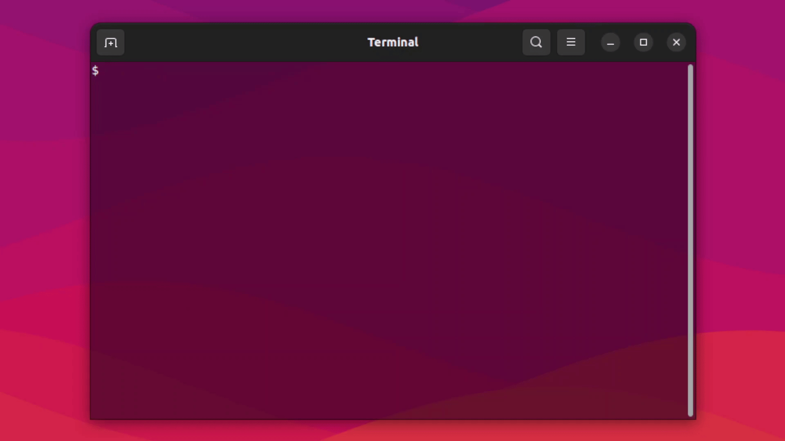
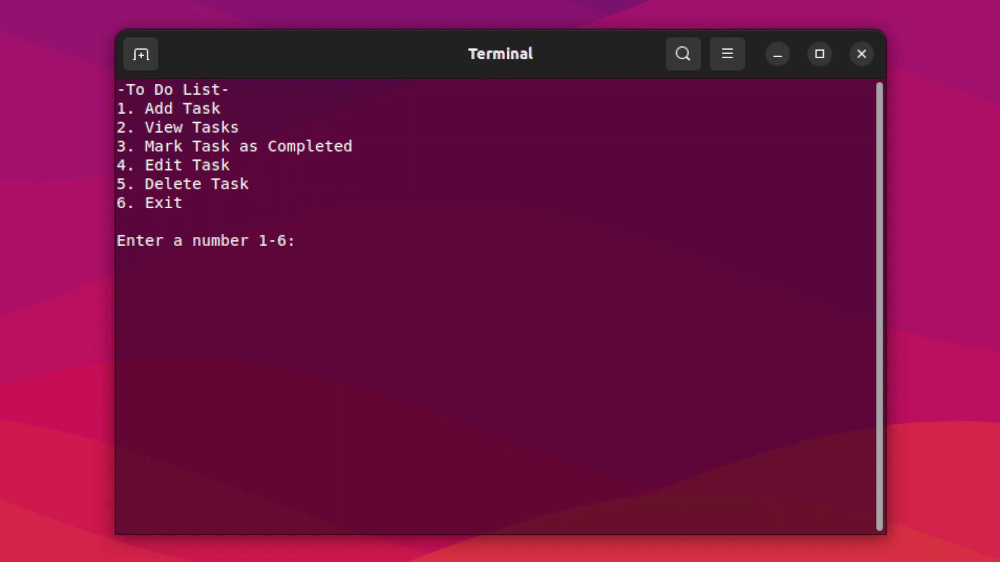
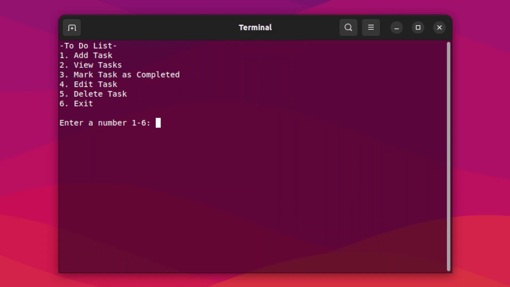

# To-Do List

This program is a highly portable command-line to-do-list application that helps users manage their tasks efficiently, with the functionality to store data on every run, and retrieve them upon restarting the application. It allows users to add new tasks, view existing tasks, mark tasks as completed, edit tasks and delete tasks.

## Features

- Simple and straightforward usage
- Highly portable
- Support for storing and exporting CSV data
- Cross-platform compatibility
- Non third-party dependencies

## Setup

To setup and run this project locally, follow these steps:

1. Download or clone the repository

    ```sh
    git clone https://github.com/invzfnc/todo-list.git
    ```

2. Compile the code

    ```sh
    g++ main.cpp -o todolist
    ```

3. Run

    Windows
    ```bat
    todolist
    ```

    Unix
    ```sh
    ./todolist
    ```

## Usage

### Adding tasks


### Viewing tasks


### Marking tasks as complete


### Editing tasks


### Deleting tasks


## License

This software is licensed under the [MIT License](https://github.com/invzfnc/todo-list/blob/main/LICENSE) © [Cha](https://github.com/invzfnc)